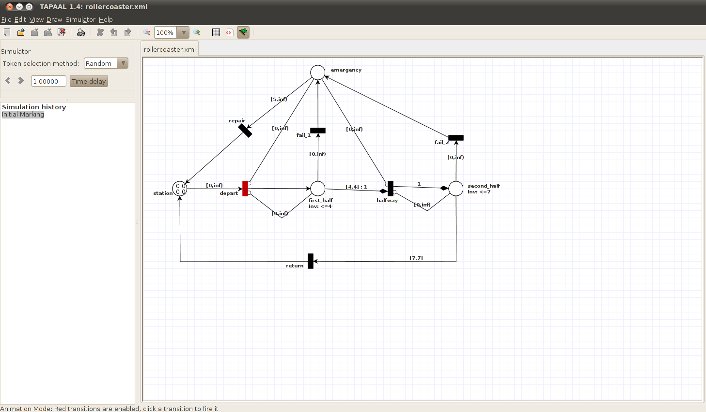

# Simulation

In this section, we will look at how TAPAAL can be used for simulation of TAPN models. We will do this in terms of an example using the simple rollercoaster model presented in the introduction. The TAPAAL model can be found [Here](http://www.tapaal.net/fileadmin/user_manual_models/rollercoaster.xml)

Clicking the green flag in the toolbar will put TAPAAL into simulation mode as illustrated in the following screenshot.

In simulation mode it is possible to simulate the behaviour of the model by firing transitions and doing time delays. This feature can be very helpful to discover simple errors in your model by allowing you to examine if your model behaves as intended.

Enabled transitions are marked with a red color as the `depart` transition in the above screenshot. Firing an enabled transition is done by clicking it. When firing a transition there might be multiple tokens of appropriate age in each input place. By default, TAPAAL will select a random token of appropriate age from each input place, however, it is possible to change how this token selection is done using the `token selection method` dropdown box in the left-hand pane. The possibilities are: `random`, `youngest` (youngest token of appropriate age selected), `oldest` (oldest token of appropriate age selected), and `manual` (manually select which token to consume from each input place).

Time delays are performed using the `Time delay` button in the left-hand pane. The text field to the left of this button specifies the duration of the time delay (default value is 1.0). Thus, to do a time delay of 2.4 time units (assuming this is possible in your model) you write 2.4 in this text field and press the button.

The lower part of the left-hand pane contains the simulation history. During simulation of your model TAPAAL will remember the history of time delays and transition firings, allowing you to step back and forth through this history. Stepping back and forth through the simulation history is done using the blue arrows above. This feature is useful if you for instance encounter a point at which you have two transitions enabled and want to examine what happens if you choose one or the other. You can just pick one of them and continue the simulation and then later step back through your history to that point and try the other transition instead of having to start over from the beginning. 

In order to illustrate some of these points consider the following example. Assume that we want to simulate that both trains of the rollercoaster goes around the track once with no failures. This can be done by following this simulation:

  - Fire the `depart` transition (first train leaves the station)
  - Do a time delay of 4.0
  - Fire the `halfway` transition (first train enters the second half of the track)
  - Fire the `depart` transition (second train can now leave the station)
  - Do a time delay of 3.0
  - Fire the `return` transition (first train is now done going around the track)
  - Do a time delay of 1.0
  - Fire the `halfway` transition (second train enters the second half of the track)
  - Do a time delay of 3.0
  - Fire the `return` transition (second train returns to station)

In order to simulate that the second train experiences a failure in the second half of the track we can step back once and fire the `fail_2` transition instead of the `return` transition and continue the simulation from there.

